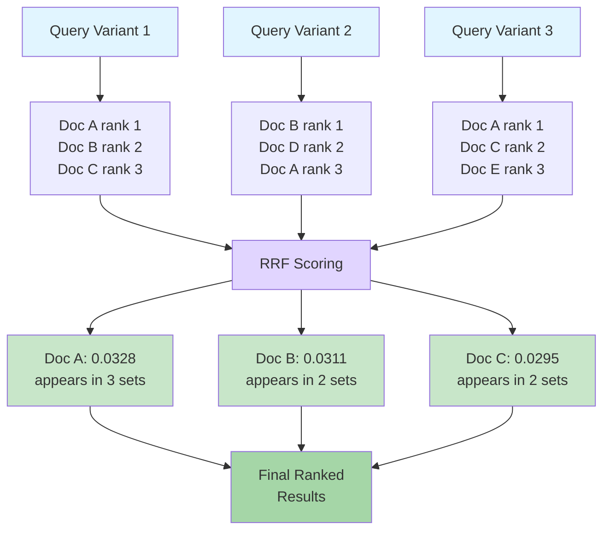
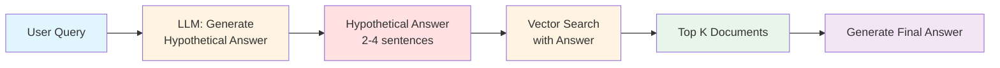
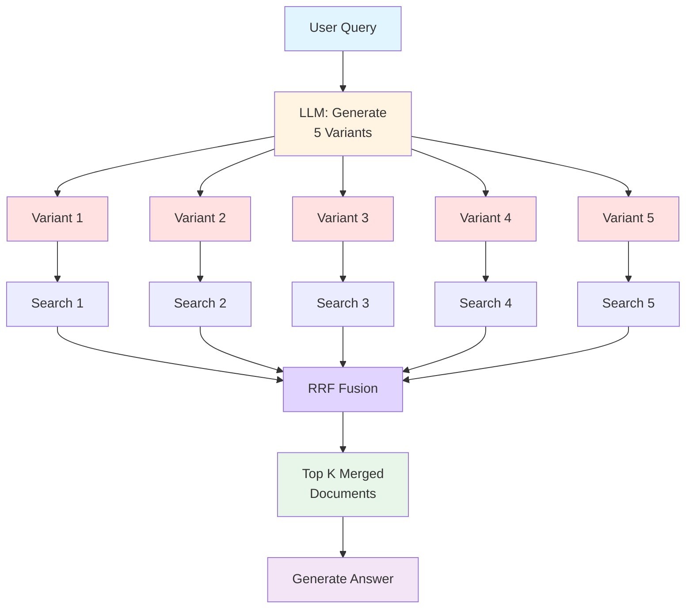
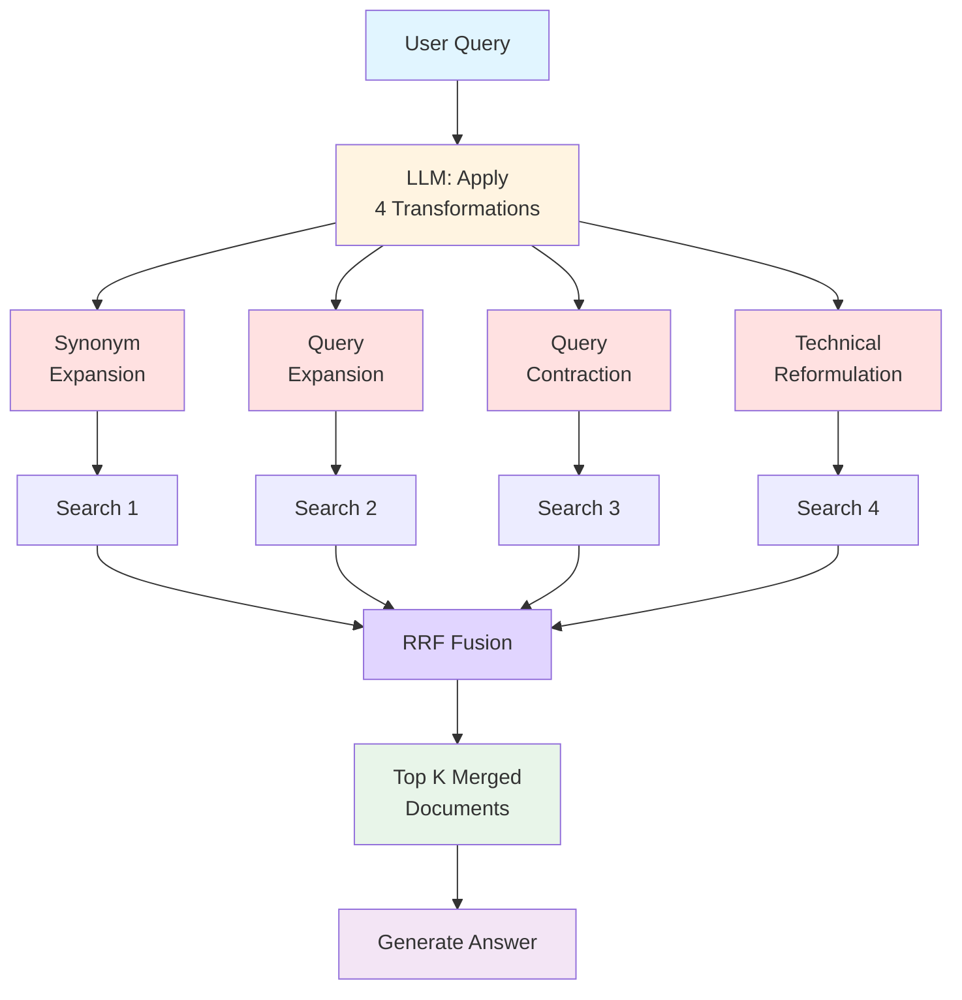
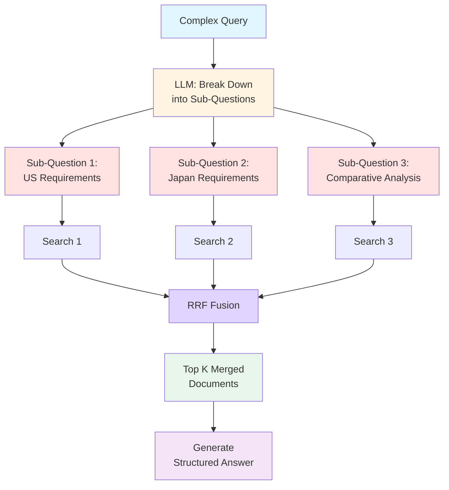
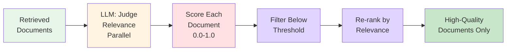
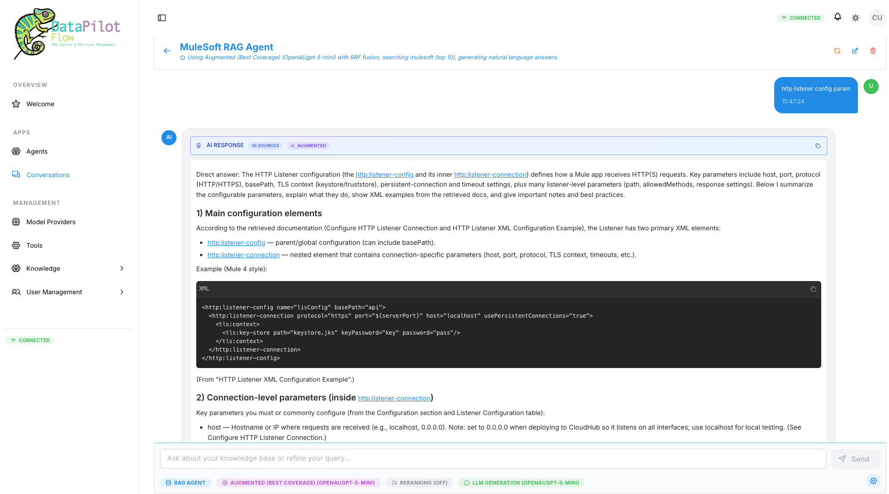
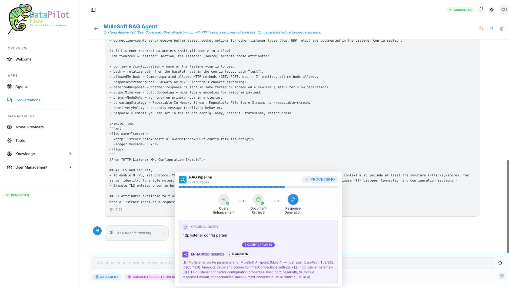
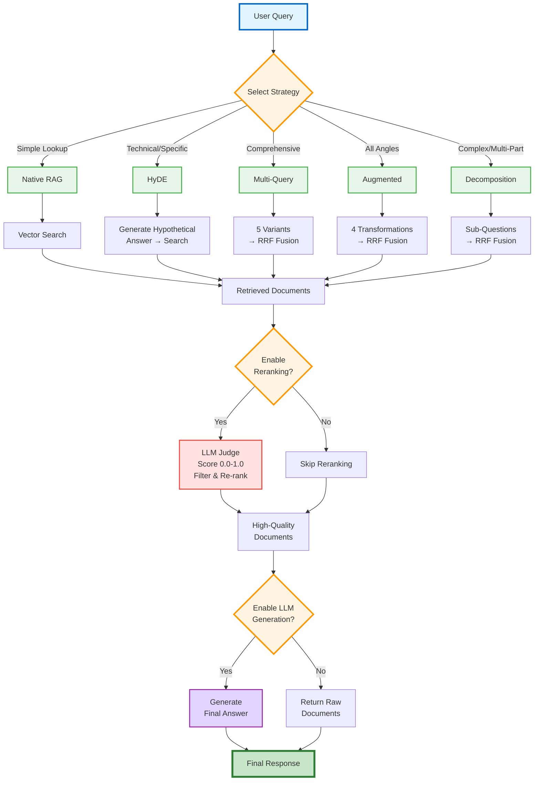

# The $800M Question: Why Your AI Gives Scattered Answers (And How I Fixed It with 5 RAG Strategies)

## 📋 Table of Contents

1. [First, Let's Talk About RAG](#first-lets-talk-about-rag)
2. [The Secret Sauce: Reciprocal Rank Fusion (RRF)](#the-secret-sauce-reciprocal-rank-fusion-rrf)
3. [The Crisis: When I Realized Basic RAG Wasn't Enough](#the-crisis-when-i-realized-basic-rag-wasnt-enough)
4. [What Happened with Basic RAG (The Disaster)](#what-happened-with-basic-rag-the-disaster)
5. [The Breakthrough: Different Questions Need Different Strategies](#the-breakthrough-different-questions-need-different-strategies)
6. [Strategy 1: Native RAG (The Baseline)](#strategy-1-native-rag-the-baseline)
7. [Strategy 2: HyDE (Hypothetical Document Embeddings)](#strategy-2-hyde-hypothetical-document-embeddings---the-game-changer)
8. [Strategy 3: Multi-Query - For Comprehensive Coverage](#strategy-3-multi-query---for-comprehensive-coverage)
9. [Strategy 4: Augmented - Systematic Exploration](#strategy-4-augmented---systematic-exploration)
10. [Strategy 5: Decomposition - For Complex Multi-Part Questions](#strategy-5-decomposition---for-complex-multi-part-questions)
11. [The Secret Weapon: LLM-Based Reranking](#the-secret-weapon-llm-based-reranking)
12. [The Outcome: How It All Came Together](#the-outcome-how-it-all-came-together)
13. [What I Learned About RAG in Production](#what-i-learned-about-rag-in-production)
14. [Why DataPilotFlow Exists](#why-datapilotflow-exists)
15. [What DataPilotFlow Supports](#-what-datapilotflow-supports)
16. [Let's Discuss](#-lets-discuss)

---

## First, Let's Talk About RAG

You know how ChatGPT sometimes just makes stuff up? That's called hallucination. RAG (Retrieval-Augmented Generation) fixes that.

**Here's the idea:**

You have thousands of pages of documents sitting in Confluence, SharePoint, wherever. You ask a question. Instead of the AI inventing an answer, it:

1. **Searches** your actual documents
2. **Pulls out** the relevant bits
3. **Generates** an answer based on what it actually found

**That's RAG** - your AI answers come from your real data, not thin air.

### The Problem: Basic RAG Often Fails

Here's where it gets tricky. Basic RAG is pretty dumb:
- You ask: *"What are the stability testing requirements for biologics?"*
- It searches with those exact words
- Returns whatever matches

**But this breaks when:**
- ❌ Your question is too vague (or too specific)
- ❌ Your docs use different words than you do
- ❌ You're asking multiple things at once
- ❌ You need the full picture, not just one piece

**For high-stakes stuff? Basic RAG is honestly dangerous.**

---

## The Secret Sauce: Reciprocal Rank Fusion (RRF)

Before I dive into the strategies, let me explain the magic behind them: **Reciprocal Rank Fusion (RRF)**.

### What is RRF?

Say you search with 5 different phrasings of the same question. You get 5 different sets of results. How do you combine them without just mashing everything together?

**That's where RRF comes in.**

### How RRF Works:



**The RRF Formula:**
```
score(document) = Σ(1 / (k + rank_i))
```

Where:
- `rank_i` = position of document in result set i
- `k` = constant (typically 60, from research paper)
- Σ = sum across all result sets where document appears

### Why RRF is Brilliant:

**Example:** Search with 3 query variants:

| Document | Variant 1 Rank | Variant 2 Rank | Variant 3 Rank | RRF Score | Appears In |
|----------|----------------|----------------|----------------|-----------|------------|
| **Doc A** | 1 (0.0164) | 3 (0.0159) | 1 (0.0164) | **0.0487** ✅ | **3 sets** |
| **Doc B** | 2 (0.0161) | 1 (0.0164) | - | **0.0325** | 2 sets |
| **Doc C** | 3 (0.0159) | - | 2 (0.0161) | **0.0320** | 2 sets |
| Doc D | - | 2 (0.0161) | - | 0.0161 | 1 set |
| Doc E | - | - | 3 (0.0159) | 0.0159 | 1 set |

**Winner: Doc A** - appeared in **3 different result sets**, proving it's relevant across multiple query phrasings!

**Formula per rank:** `1/(60+rank)` where rank is position in that result set.

### Key Benefits:

1. ✅ **Promotes consensus** - Documents appearing in multiple result sets rank higher
2. ✅ **Reduces noise** - One-off matches rank lower
3. ✅ **No parameter tuning** - Works out of the box (k=60 is standard)
4. ✅ **Robust to outliers** - Bad results from one variant don't dominate
5. ✅ **Proven by research** - Outperforms other fusion methods

### When RRF is Used:

RRF is automatically applied when you have **multiple query variants**:
- ✅ **Multi-Query** strategy (5 alternative phrasings)
- ✅ **Augmented** strategy (4 transformation types)
- ✅ **Decomposition** strategy (2-5 sub-questions)
- ❌ **Native RAG** (single query, no fusion needed)
- ❌ **HyDE** (single hypothetical answer, no fusion needed)

**This is why multi-variant strategies are so powerful - RRF intelligently combines results!**

---

## The Crisis: When I Realized Basic RAG Wasn't Enough

I've been building AI for pharma teams dealing with insanely complex documentation. One project really opened my eyes.

**The Situation:**

A regulatory team was staring down a critical drug submission. They had everything they needed buried in **5,000+ Confluence pages**:
- SOPs (Standard Operating Procedures)
- ICH/FDA/EMA guidelines
- Past submissions
- Quality docs

**The Problem:**

Their search was useless. Type anything in, get 500+ results, 90% garbage. Manual review? Weeks.

**The Stakes:**
- **$800M+ revenue** on the line
- **Patients waiting** for life-saving meds
- Deadline breathing down their necks

They asked: *"Can AI fix this?"*

I said: "Yeah, RAG should handle it."

**Spoiler: It didn't.**

---

## What Happened with Basic RAG (The Disaster)

**Query:** *"What are the stability testing requirements for biologics?"*

**What basic RAG gave us:**
- Document 1: Generic stability stuff (not even biologic-specific)
- Document 2: Random fragment from page 89 of a 400-page guideline
- Document 3: Completely unrelated testing procedures
- Document 4: An outdated SOP from 2018

**The team's response:**

😤 *"This gives us 4 disconnected fragments. We still need to manually read thousands of pages. This doesn't solve our problem."*

**Ouch. That hurt.**

That's when it hit me: **Basic RAG doesn't work for complex, high-stakes stuff.**

---

## The Breakthrough: Different Questions Need Different Strategies

After weeks of testing and a lot of trial and error, I figured something out:

**Not all questions are the same.**

Some are simple lookups. Others need you to think through multiple steps. Others need you to cast a wide net and catch everything.

**The solution?** Stop using one approach for everything. Build different strategies for different types of questions.

Here are the 5 strategies I ended up building:

---

## Strategy 1: Native RAG (The Baseline)

**When to use it:** Simple, straightforward lookups

**How it works:**


**Steps:**
1. User asks a question
2. System searches directly with that question
3. Returns top matching documents
4. Generates answer

**Real Example:**
```
Question: "What is the shelf life for Product X?"
Result: Found in 2 seconds from product specs
Team: ✅ "Perfect!"
```

**When to use it:** If you know the answer is in one doc and you're using the right words, stick with Native RAG. Fast and simple.

---

## Strategy 2: HyDE (Hypothetical Document Embeddings) - The Game Changer

**The Problem It Solves:**

When searching for *"stability testing requirements for biologics"*, Basic RAG finds documents about:
- General stability (wrong focus)
- Testing procedures (too broad)
- Biologics overview (not specific enough)

**HyDE Solution:**



**Steps:**
1. **First, generate what an EXPERT ANSWER would look like**
2. **Then search using that hypothetical answer** (not the short question)
3. **Find documents semantically similar to the expert answer**

**Real Example:**

```
Question: "What are the stability testing requirements for biologics?"

HyDE generates hypothetical answer:
"Stability testing for biologics requires ICH Q5C guidelines compliance, 
including accelerated studies at 25°C±2°C, long-term studies at 5°C±3°C 
for 12+ months, and stress testing to evaluate degradation pathways. 
Assays must measure potency, purity, and aggregation using validated methods..."

Searches with that rich answer → Finds EXACT regulatory guidance!
```

**Result:**
- ✅ Found exact ICH Q5C sections
- ✅ Retrieved FDA biologic stability guidance  
- ✅ Pulled relevant internal SOPs

**Team:** ✅ *"This is exactly what we needed!"*

**When to use it:** Technical or regulatory questions where exact terminology matters. HyDE is your friend.

---

## Strategy 3: Multi-Query - For Comprehensive Coverage

**The Problem It Solves:**

Consider: *"Post-approval changes for drug products in EU and US"*

This needs information from:
- EU post-marketing variation guidelines
- FDA SUPAC guidance
- Comparative requirements
- CMC changes procedures

Basic RAG gives ONE perspective. You need ALL of them.

**Multi-Query Solution:**



**Steps:**
1. AI generates **5 alternative phrasings** of the same question:
   - "EU post-marketing variation guidelines"
   - "FDA SUPAC guidance for drug changes"
   - "Comparative regulatory requirements US vs EU"
   - "CMC changes post-approval procedures"
   - "Regulatory submission requirements for manufacturing changes"

2. Searches with **ALL 5 variants in parallel**

3. **Reciprocal Rank Fusion (RRF)** intelligently merges results

**Real Example:**

```
Question: "Post-approval changes for drug products in EU and US"
Multi-Query: Searches 5 different angles in parallel
RRF: Merges results intelligently
Result: Comprehensive answer covering all jurisdictions
Team: ✅ "This would have taken days of manual research!"
```

**Result:**
- ✅ Comprehensive coverage across jurisdictions
- ✅ Finds both EU and US regulations
- ✅ Captures different document styles

**When to use it:** When you need comprehensive coverage and can't afford to miss anything. Multi-Query casts the widest net.

---

## Strategy 4: Augmented - Systematic Exploration

**The Problem It Solves:**

Need to explore a topic from ALL angles: technical, simple, broad, narrow.

**Augmented Solution:**



**Steps:**
1. AI applies **4 transformation types** to the query:
   - **Synonym Expansion**: "therapeutic equivalence criteria for generic pharmaceuticals"
   - **Query Expansion**: "bioequivalence requirements including dissolution testing and pharmacokinetic studies"
   - **Query Contraction**: "generic drug bioequivalence"
   - **Technical Reformulation**: "demonstrate same therapeutic effect as brand-name drug"

2. Searches with **ALL variants + original query**

3. **RRF** merges results from all angles

**Real Example:**

```
Question: "Bioequivalence requirements for generic drugs"
Augmented: 4 transformation types + original
Result: Comprehensive coverage from technical to layman terms
Team: ✅ "We found guidelines we didn't even know existed!"
```

**Result:**
- ✅ Fills all retrieval gaps
- ✅ Explores technical + layman terminology
- ✅ Broad + narrow perspectives
- ✅ Most comprehensive coverage

**When to use it:** Critical queries where missing info could cost you millions. Augmented explores every angle.

---

## Strategy 5: Decomposition - For Complex Multi-Part Questions

**The Problem It Solves:**

Consider: *"Analyze impact of API manufacturing site change on bioequivalence for generic drug in US and Japan"*

This isn't a search problem. It's an **ANALYSIS problem** requiring structured reasoning.

**Decomposition Solution:**



**Steps:**
1. AI **breaks down into simpler sub-questions**:
   - "US bioequivalence requirements for API manufacturing changes"
   - "Japan bioequivalence requirements for API site changes"
   - "Comparative analysis US vs Japan bioequivalence"

2. Searches **each sub-question separately**

3. **RRF** merges all results for comprehensive answer

**Real Example:**

```
Question: "Analyze API site change impact on bioequivalence in US and Japan"
Decomposition: 3 sub-questions
Each sub-question: Separate retrieval
RRF: Merges all results
Result: Structured, step-by-step analysis
Team: ✅ "This is exactly the structure we needed!"
```

**Result:**
- ✅ Structured, step-by-step answers
- ✅ No information gaps
- ✅ Multi-jurisdictional coverage
- ✅ Dramatically improved accuracy

**When to use it:** Complex, multi-part questions that need structured thinking. Decomposition breaks it down step by step.

---

## The Secret Weapon: LLM-Based Reranking

**After retrieval, add a quality filter:**



Instead of just trusting keyword/semantic match scores, I added a reranking step:

**Steps:**
1. LLM judges each retrieved document's **true relevance** (score 0.0-1.0)
2. Filters out low-relevance documents (below threshold)
3. Re-ranks by actual relevance to the question
4. **Async parallel processing** for speed

**Result:**
- ✅ Only highly relevant documents surface
- ✅ No noise or false positives
- ✅ Significantly improved precision

---

## The Outcome: How It All Came Together

After implementing all 5 strategies + reranking, I tested again.

**Same team. Same knowledge base. Same complex questions.**

### See DataPilotFlow in Action:

Here's what the platform actually looks like when you ask a question:

#### 1️⃣ **The Final Result: Comprehensive, Cited Answers**



*The AI delivers a complete answer about MuleSoft HTTP Listener configuration, pulling from **10 different sources** across the knowledge base. Notice the blue hyperlinks? Those are citations - click any one to see the exact source document. Every claim is backed by real documentation.*

**What you're seeing:**
- ✅ **Strategy Badge**: "AUGMENTED (BEST COVERAGE)" - User selected this strategy for comprehensive coverage
- ✅ **Source Count**: "10 SOURCES" - Comprehensive retrieval from multiple documents
- ✅ **Clickable Citations**: Every technical detail links back to source docs
- ✅ **Structured Answer**: Main configuration elements, connection parameters, examples

#### 2️⃣ **The Magic Happens Behind the Scenes**



*Watch as the user's selected **Augmented strategy** generates 4 query variants and processes them through the pipeline. Notice the "PROCESSING" indicator - this is RRF fusion happening in real-time! Every stage is visible: Query Enhancement → Document Retrieval → Judge Ranker → Response Generation. You see exactly what the AI is doing at each step. No black boxes.*

**This is what production-ready RAG looks like.**

---

### The Complete RAG Pipeline:



**Query:** *"What are the stability testing requirements for biologics across FDA, EMA, and ICH guidelines?"*

**DataPilotFlow Decision Flow:**
1. 🎯 **Strategy Selected:** Decomposition (complex multi-jurisdiction query)
2. 🔀 **RRF Applied:** Merged results from jurisdiction-specific sub-questions
3. ⚖️ **Reranking Enabled:** LLM judged relevance, filtered low-quality docs
4. 🤖 **LLM Generation Enabled:** Generated comprehensive answer with citations

**Result:** Complete, cross-referenced analysis with exact guideline citations.

**The Head of Regulatory Affairs:**

✅ *"This is exactly what we needed. This is how AI should work."*

### The Impact:

**Submission Success:**
- ✅ Found every relevant guideline, SOP, and past submission
- ✅ Submission completed successfully
- ✅ **$800M+ revenue protected**
- ✅ **Patients received medication earlier**

**Team Productivity:**
- ✅ What took weeks of manual review → Completed much faster
- ✅ Regulatory team processed 10x more requirements
- ✅ Zero compliance issues found in review

**But more importantly:** Patients got their medicine sooner.

---

## What I Learned About RAG in Production

### 1. **One Size Does NOT Fit All**
Different questions need different strategies. Full stop.

### 2. **How You Search Matters More Than What Model You Use**
Seriously. Query enhancement beats fancy embeddings every time.

### 3. **Always Show Your Work**
Pharma, legal, finance - they all need to see which docs you pulled from. No black boxes.

### 4. **Speed Matters, But Not As Much As Accuracy**
Users won't wait 30 seconds. But they'll wait 10 if it means not missing something critical.

### 5. **Basic RAG is Dangerous for High-Stakes Stuff**
Miss one guideline? That could cost millions. You can't afford scattered, incomplete answers.

---

## Why DataPilotFlow Exists

This experience made something clear:

**Every company with complex docs faces this exact problem.**

- Legal teams drowning in case law
- Engineers hunting through technical specs
- Finance teams buried in compliance docs
- Medical affairs searching clinical guidelines
- HR teams lost in policy documents

**Basic RAG fails for all of them.**

That's why I'm building **DataPilotFlow** - because high-stakes knowledge work needs better tools.

🔗 **GitHub Repository:** [https://github.com/bassem-elsodany/datapilotflow](https://github.com/bassem-elsodany/datapilotflow)
---

## 📚 What DataPilotFlow Supports

**Data Sources:**
- 📄 Confluence (spaces, pages, labels)
- 🌐 Web scraping (single page, multiple pages, entire websites)
- 📁 Local files (PDF, DOCX, HTML, Markdown, TXT, PPT, XLS, EPUB)

**RAG Strategies:**
- 🎯 Native RAG (simple lookups)
- 🧠 HyDE (hypothetical document embeddings)
- 🔍 Multi-Query (comprehensive coverage)
- 🎨 Augmented (systematic exploration)
- 🧩 Decomposition (complex analysis)

**Quality Enhancements:**
- 🔀 Reciprocal Rank Fusion (intelligent result merging)
- 🎯 LLM-based reranking (precision filtering)
- 📊 Relevance scoring (quality metrics)

---

## 💬 Let's Discuss

**What's YOUR biggest challenge with document search?**

Drop a comment below. Let's discuss your specific use case.

Some questions I can answer:
- How does this compare to ChatGPT with RAG?
- Can it work with [your specific doc type]?
- What about data privacy?
- Integration with existing tools?

🔗 **Check out the code:** [https://github.com/bassem-elsodany/datapilotflow](https://github.com/bassem-elsodany/datapilotflow)
---

**#DataPilotFlow #RAG #AIinPharma #GenerativeAI #RegulatoryAffairs #MachineLearning #EnterpriseAI #Productivity #Innovation #LifeSciences #ClinicalDevelopment #Pharmacovigilance #AIStrategies #ComingSoon**

---

*Building DataPilotFlow - Making AI actually useful for complex knowledge work.*

**🚀 Launching Soon | 🔔 Follow for Updates | 💬 Share Your Challenges**

**🔗 GitHub:** [https://github.com/bassem-elsodany/datapilotflow](https://github.com/bassem-elsodany/datapilotflow)

---

**P.S.** If you're dealing with complex documentation in pharma, legal, engineering, or any other field - share your story in the comments. Real-world challenges drive better solutions.
